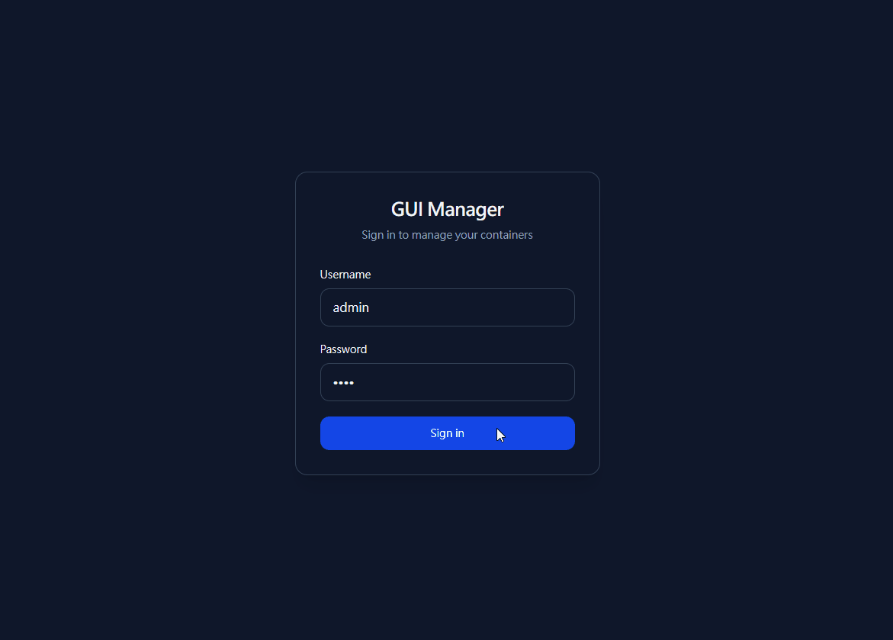
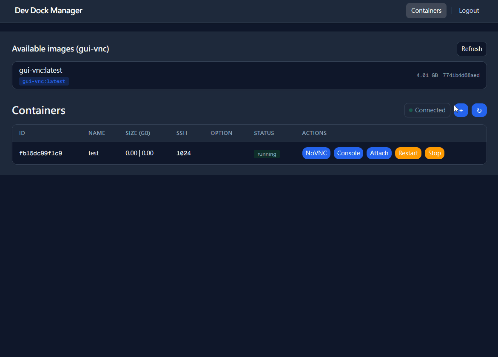
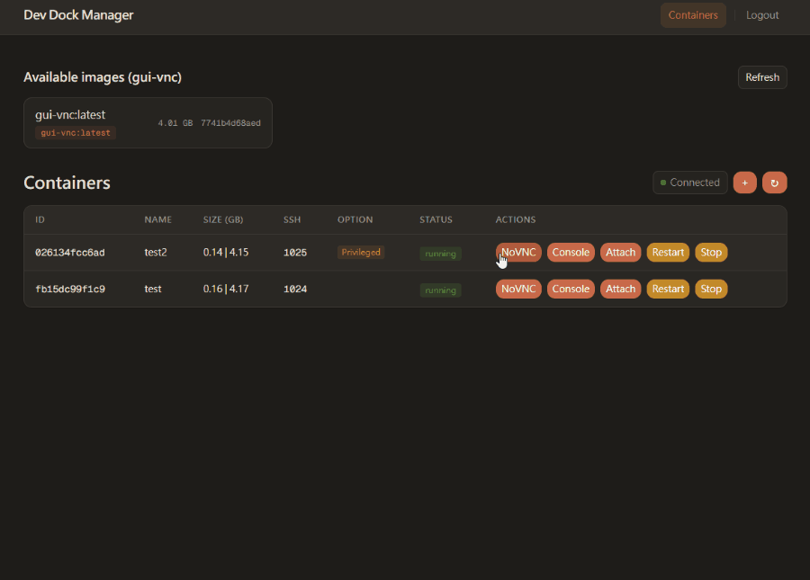

<div align="center">

# **Dev Dock Manager**

<p>
  
</p>

A small SaaS for managing Docker-based GUI dev environments: create containers, use a web terminal and NoVNC from one dashboard. Backend is a Rust API; frontend is a React/Next.js app. All run behind Traefik on a single machine.

You can find Python/Django version [here](https://github.com/NatLee/dev-dock-manager).

</div>

---

## What’s in this repo

- **Traefik** – Reverse proxy for the app and for multi-instance NoVNC.
- **Rust API** – Auth (JWT), containers, images, ports, console/WebSocket. Default port: `0.0.0.0:8000`.
- **Frontend** – Dashboard (container list, create, web terminal, NoVNC).
- **Redis** – Used by the backend (e.g. task queue).
- **Nvidia Docker** – Optional; `docker-compose` includes an `nvidia-cuda` service to verify the host can run Nvidia Docker.

## Interface

- **Create container**  
  

- **Web terminal**  
  

- **NoVNC**  
  

## Nvidia Docker support

Optional. Needs Nvidia drivers and Nvidia Docker runtime on the host. If available, you can enable GPU when creating a container.

---

## Usage

- **Platform**: Linux (Docker socket). On Windows, use Docker inside WSL.
- **Submodule**: Clone the GUI container image from [dev-dock](https://github.com/NatLee/dev-dock) first:

```bash
git submodule update --init --recursive
```

### Quick start

1. **Create network and start stack** (Docker daemon must be running):

```bash
docker network create d-gui-network
docker compose build && docker compose up -d
```

2. **Build GUI image** (or pull [natlee/gui-vnc](https://hub.docker.com/r/natlee/gui-vnc)):

```bash
cd gui && docker-compose build && cd ..
```

3. **Create the first user** (for login):

```bash
./dev-tool.sh create-superuser
```

Defaults: username `admin`, password `1234`. To pass options (e.g. `--staff`, `--email`), run the script with args or use:

```bash
docker exec -it d-gui-manager-backend /app/dev-dock-manager-api create-user admin mypassword --staff
```

4. Open **http://localhost:8000/dashboard** and log in.

### Dev helper script

From the project root:

```bash
./dev-tool.sh --help
```

- `bash` – Shell in the backend container (`d-gui-manager-backend`).
- `create-superuser` – Create a login user (Rust `create-user`).
- `logs` – Follow backend logs.
- `backend-debug` – Run backend in a one-off container with `RUST_LOG=debug`.

---

## API (backend)

- **Health**: `GET http://localhost:8000/health` → `ok`
- **Prefix**: `/api` (e.g. `/api/auth/token`, `/api/containers`, `/api/ports`).

**Web terminal / Console**: Frontend calls `GET /api/console/:action/:id` for metadata, then connects to WebSocket `/ws/console` with subprotocol `token.<base64_jwt>, container.<container_id>`. Messages: `shell`, `attach`, `pty_input`, `pty_resize`.

**Backend layout** (high level): `backend/src/api/` (auth, containers, images, ports), `backend/src/ws/` (console & notifications), `backend/src/docker/` (bollard), `backend/src/queue/`, `backend/src/db/` (users, SQLite + Argon2).

---

## License

[MIT](./LICENSE)
